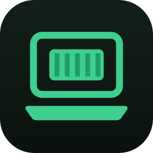

# Colima Desktop

<p align="center">
  
</p>

[](https://github.com/alperen-selcuk/colima-desktop/actions/workflows/ci.yml)
[](./LICENSE)

A desktop app for [Colima](https://github.com/abiosoft/colima) on macOS & Linux.

> **Independent project notice / Bağımsız proje notu:** Colima Desktop is an independent, open-source
> project. It is **not affiliated with, endorsed by, or maintained by** the Colima maintainers — it simply
> uses Colima as its engine. Bu proje Colima'nın resmi bir parçası değildir; Colima'yı arka planda motor
> olarak kullanan bağımsız bir topluluk projesidir.

## Install / Kurulum

```sh
# macOS — Homebrew
brew tap alperen-selcuk/tap
brew trust --cask alperen-selcuk/tap/colima-desktop   # older Homebrew versions can skip this step
brew install colima-desktop

# macOS / Linux — install script
curl -fsSL https://raw.githubusercontent.com/alperen-selcuk/colima-desktop/main/scripts/install.sh | bash
```

See [docs/INSTALL.md](docs/INSTALL.md) for manual downloads, uninstall instructions, and details
(TR + EN).

## Türkçe

Colima Desktop, [Colima](https://github.com/abiosoft/colima) (bir Docker Desktop alternatifi) için macOS ve
Linux üzerinde çalışan, Tauri v2 tabanlı, bağımsız ve açık kaynak bir masaüstü arayüzüdür. Colima makinelerini
(profillerini) başlatıp durdurmanızı, Kubernetes'i etkinleştirmenizi, container/image/volume yönetmenizi,
entegre bir terminalden makinenize/container'lara/pod'lara bağlanmanızı ve Kubernetes iş yüklerini (pod,
deployment, service, node) görüntülemenizi sağlar.

### Özellikler

- Birden fazla Colima profili (makine) için yaşam döngüsü yönetimi: başlat, durdur, yeniden başlat, sil.
- Ayrıntılı "Yeni makine" / "Başlat" diyaloğu: CPU, bellek, disk, runtime (docker/containerd/incus), VM tipi
  (vz/qemu), mimari, mount tipi, Rosetta, ağ adresi, Kubernetes ve mount listesi.
- Container yönetimi (yalnızca `docker` runtime'ında): başlat/durdur/yeniden başlat/duraklat/sil, canlı log akışı,
  `docker inspect` çıktısı, canlı istatistikler, compose projesine göre gruplama, port linklerini tarayıcıda açma.
- Image yönetimi: pull (akan çıktı ile), silme, kullanılmayanları temizleme (prune), "in use" rozeti.
- Volume yönetimi: listeleme, silme, kullanılmayanları temizleme.
- Kubernetes sekmesi: Pods, Deployments, Services, Nodes; log/describe/yaml paneli, ölçekleme, deployment
  yeniden başlatma, pod silme.
- **Entegre terminal paneli**: pencerenin altında açılıp kapanabilen, yeniden boyutlandırılabilir bir panel
  (`Ctrl+\``ile aç/kapat). "Output" sekmesinde makine/işlem logları akar; ayrıca yerel kabuk, Colima VM'i,
  bir container veya bir pod için gerçek bir terminal (xterm.js) sekmesi açabilirsiniz — hepsi uygulama
  içinde, harici bir terminal penceresi açılmadan.
- **Tema seçici** (Sistem / Açık / Koyu): kenar çubuğunun altında bir geçiş anahtarı; Colima yeşili vurgu
  rengi hem açık hem koyu temada markanın parçasıdır; açık tema tam olarak tasarlanmıştır (basit bir
  ters çevirme değildir).
- Sistem tepsisi: profil durumunu gösterir, hızlı başlat/durdur, pencereyi göster/gizle.

### Gereksinimler

- [colima](https://github.com/abiosoft/colima) (PATH üzerinde)
- `docker` CLI (PATH üzerinde)
- `kubectl` (Kubernetes özelliklerini kullanmak için, PATH üzerinde) — **güvenlik notu**: Colima Desktop
  `kubectl` çağırırken her zaman seçili Colima profiline ait context'i açıkça belirtir; kubeconfig'inizdeki
  mevcut/aktif context asla okunmaz veya değiştirilmez. Kubeconfig'inizde üretim (örn. AKS) cluster'ları
  olsa bile bunlara yanlışlıkla komut gönderilmez.
- Node.js ve npm (geliştirme için), Rust toolchain (derleme için)

### İndirme

Hazır paketleri derlemeden kullanmak isterseniz [GitHub Releases](https://github.com/alperen-selcuk/colima-desktop/releases)
sayfasından işletim sisteminize uygun paketi indirebilirsiniz (macOS için `.app`/`.dmg`, Linux için
`.deb`/`.AppImage`/`.rpm`).

> **Not:** macOS paketleri şu an imzalı/notarize değildir. Uygulamayı ilk açtığınızda Gatekeeper uyarı
> verirse, karantina niteliğini terminalden kaldırabilirsiniz:
>
> ```bash
> xattr -dr com.apple.quarantine "/Applications/Colima Desktop.app"
> ```

Linux'ta derleme için ek paketler gerekir (Debian/Ubuntu örneği):

```
sudo apt-get install -y libwebkit2gtk-4.1-dev libayatana-appindicator3-dev librsvg2-dev \
  build-essential libssl-dev libxdo-dev file curl wget
```

### Geliştirme ve derleme

```bash
npm install
npm run tauri dev     # geliştirme modunda çalıştır
npm run tauri build   # dağıtılabilir paketleri üret
```

Derlenen paketler şurada oluşur: `src-tauri/target/release/bundle/...`
(macOS için `.app`/`.dmg`, Linux için `.deb`/`.AppImage`/`.rpm`).

---

## English

Colima Desktop is an independent, open-source, native Tauri v2 desktop GUI for
[Colima](https://github.com/abiosoft/colima) (a Docker Desktop alternative) on macOS and Linux. It lets you
start/stop Colima machines (profiles), enable Kubernetes, manage containers/images/volumes, open an
integrated terminal into your machine/containers/pods, and browse Kubernetes workloads (pods, deployments,
services, nodes).

### Features

- Lifecycle management for multiple Colima profiles: start, stop, restart, delete.
- Detailed "New machine" / "Start" dialog: CPU, memory, disk, runtime (docker/containerd/incus), VM type
  (vz/qemu), architecture, mount type, Rosetta, network address, Kubernetes toggle, and a mounts editor.
- Container management (when runtime is `docker`): start/stop/restart/pause/remove, live log streaming,
  `docker inspect` output, live stats, grouping by compose project, clickable port links opened in the browser.
- Image management: pull (with streamed output), delete, prune unused, "in use" badge.
- Volume management: list, delete, prune unused.
- Kubernetes tab: Pods, Deployments, Services, Nodes; logs/describe/yaml detail drawer, scaling, deployment
  restart, pod deletion.
- **Integrated terminal dock**: a resizable, IDE-style bottom panel (toggle with `Ctrl+\``). Its Output tab
  streams machine/operation logs; you can also open real terminal tabs (powered by xterm.js) into a local
  shell, the Colima VM, a container, or a pod — all inside the app, with no external terminal window.
- **Theme switcher** (System / Light / Dark): a segmented control in the sidebar footer; the Colima green
  accent carries the brand in both dark and light mode, and the light theme is fully designed (not a naive
  inversion of dark mode).
- System tray: shows profile status, quick start/stop, show/hide window.

### Requirements

- [colima](https://github.com/abiosoft/colima) on your `PATH`
- `docker` CLI on your `PATH`
- `kubectl` on your `PATH` (for Kubernetes features) — **safety note**: Colima Desktop always passes an
  explicit `kubectl` context tied to the selected Colima profile (`colima` or `colima-<profile>`). It never
  reads or changes your kubeconfig's current/active context, so production clusters in your kubeconfig
  (e.g. AKS) are never accidentally targeted.
- Node.js and npm (for development), Rust toolchain (for building)

### Download

If you'd rather not build from source, grab a prebuilt package for your OS from the
[GitHub Releases](https://github.com/alperen-selcuk/colima-desktop/releases) page
(`.app`/`.dmg` on macOS, `.deb`/`.AppImage`/`.rpm` on Linux).

> **Note:** macOS builds are currently unsigned/unnotarized. If Gatekeeper blocks the app on first launch,
> clear the quarantine attribute from a terminal:
>
> ```bash
> xattr -dr com.apple.quarantine "/Applications/Colima Desktop.app"
> ```

Linux build dependencies (Debian/Ubuntu example):

```
sudo apt-get install -y libwebkit2gtk-4.1-dev libayatana-appindicator3-dev librsvg2-dev \
  build-essential libssl-dev libxdo-dev file curl wget
```

### Development and build

```bash
npm install
npm run tauri dev     # run in development mode
npm run tauri build   # produce distributable bundles
```

Bundles are produced under `src-tauri/target/release/bundle/...`
(`.app`/`.dmg` on macOS, `.deb`/`.AppImage`/`.rpm` on Linux).

See [CHANGELOG.md](./CHANGELOG.md) for release notes.

## Icons

The Kubernetes page uses the official Kubernetes icon set (`public/k8s-icons/`) from
[kubernetes/community](https://github.com/kubernetes/community/tree/main/icons) and the Kubernetes wheel
logo from [kubernetes/kubernetes](https://github.com/kubernetes/kubernetes/blob/master/logo/logo.svg),
© The Kubernetes Authors, licensed under [CC-BY-4.0](https://creativecommons.org/licenses/by/4.0/). See
`public/k8s-icons/NOTICE` for full attribution.

The Containers page's image brand icons use [Simple Icons](https://simpleicons.org/) ([CC0](https://creativecommons.org/publicdomain/zero/1.0/)); all trademarks belong to their respective owners.

## License

MIT — see [LICENSE](./LICENSE).
